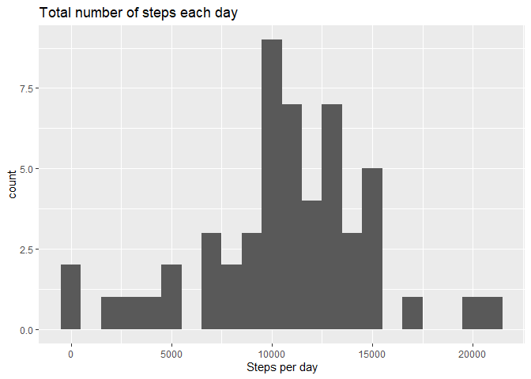
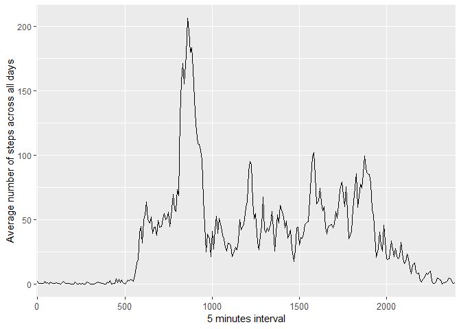
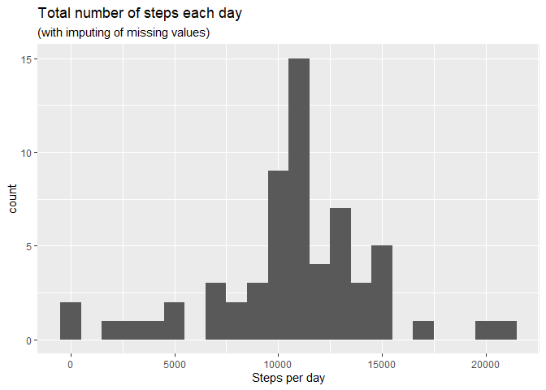

## Loading and preprocessing the data

```r
library(ggplot2)
library(plyr)

data.raw <- read.csv(unz("activity.zip","activity.csv"))
data.raw$date <- as.Date(data.raw$date)
data.process <- data.raw[!is.na(data.raw$steps),]
```


## What is mean total number of steps taken per day?

```r
data.perday <- aggregate(data.process[,-2], by=list(data.process$date),FUN = sum)

perday.median <- median(data.perday$steps)
perday.mean <- mean(data.perday$steps)

ggplot(data.perday, aes(x=steps)) + 
    geom_histogram(binwidth=1000) + labs(title = "Total number of steps each day", x= "Steps per day")
```

<!-- -->

```r
print(paste("Mean steps per day :",round(perday.mean,1)))
```

```
## [1] "Mean steps per day : 10766.2"
```

```r
print(paste("Median steps per day :",round(perday.median)))
```

```
## [1] "Median steps per day : 10765"
```

## What is the average daily activity pattern?

```r
data.perinterval <- aggregate(data.process[,1], by=list(data.process$interval),FUN = mean)
names(data.perinterval)<-c("interval","steps")

g <- ggplot(data = data.perinterval) + aes(x = factor(interval), y = steps, group = 1) + geom_line() + labs(x ="5 minutes interval", y = "Average number of steps across all days") + theme(axis.text.x = element_text(size = 0)) 
g 
```

<!-- -->

The inteval with the maximum number of steps is:


```r
data.perinterval[which.max(data.perinterval$steps),]$interval
```

```
## [1] 835
```

## Imputing missing values

There number of missing values for the "steps" variable is:


```r
sum(is.na(data.raw$steps))
```

```
## [1] 2304
```
The strategy to imput missing values is to take the mean across all days for the corresponding interval.


```r
data.process <- data.raw
data.nan <- data.process[is.na(data.process),]
fn <- function(interv) {data.perinterval[data.perinterval$interval ==interv,]$steps}
data.imput <- ddply(data.nan, c("steps","interval"), transform, steps=fn(interval))
data.imput <- data.imput[order(data.imput$date, data.imput$interval),] 
data.process[is.na(data.process),]$steps <- data.imput$steps
```

Let's replot the same histogram as the first figure of this document.


```r
data.perday <- aggregate(data.process[,-2], by=list(data.process$date),FUN = sum)

perday.median <- median(data.perday$steps)
perday.mean <- mean(data.perday$steps)

ggplot(data.perday, aes(x=steps)) + 
    geom_histogram(binwidth=1000) + labs(title = "Total number of steps each day", subtitle = "(with imputing of missing values)", x= "Steps per day")
```

<!-- -->

```r
print(paste("Mean steps per day :",round(perday.mean,1)))
```

```
## [1] "Mean steps per day : 10766.2"
```

```r
print(paste("Median steps per day :",round(perday.median)))
```

```
## [1] "Median steps per day : 10766"
```

## Are there differences in activity patterns between weekdays and weekends?
